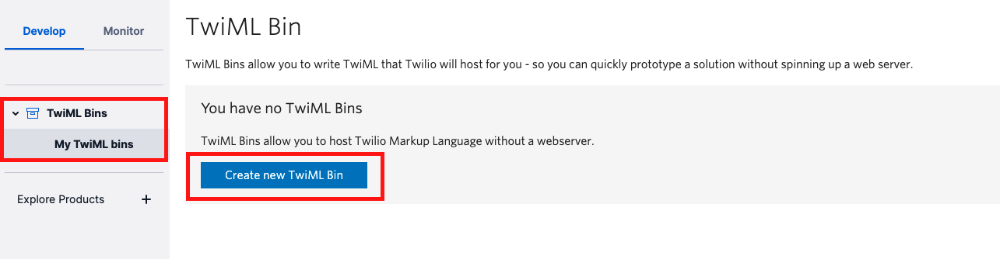
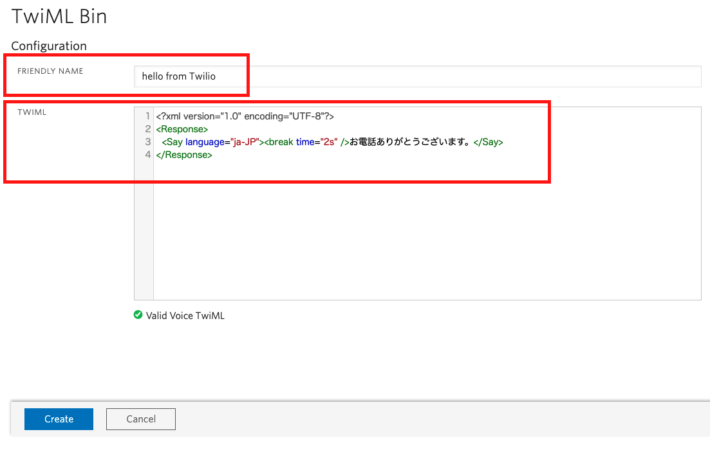

#  手順1: TwiML Binsを使った応答 

Twilioは[TwiML](https://jp.twilio.com/docs/voice/twiml)と呼ばれる独自のマークアップ言語を用いて着信への応答を定義できます。

この手順では着信に対して定型メッセージを流す用途で利用できる[TwiML Bins](https://jp.twilio.com/docs/runtime/tutorials/twiml-bins)の利用方法を学習します。

## 1-1: TwiML Binの作成

[コンソール](https://jp.twilio.com/console/twiml-bins)または、下記のようにサイドバーから`TwiML Bins`をクリックし画面を開きます。


続けて何も作成していない場合は`Create new TwiML Bin`ボタンをクリックします。



## 1-2: TwiMLを定義

次の画面では2箇所を設定します。

|  項目名 |  説明  |
| :---- | :---- |
|  FRIENDLY NAME  |  このTwiML Binを識別できる任意の名前  |
|  TWIML  | 応答（下記参照） |

TwiMLを次のように設定します。正しく定義できていればエディタ下部に`Valid Voice TwiML`と表示されます。

```xml
<?xml version="1.0" encoding="UTF-8"?>
<Response>
  <Say language="ja-JP">お電話ありがとうございます。</Say>
</Response>
```



表示が正しいことを確認したのち、`Create`ボタンをクリックし作成します。


作成が成功すると新たに`Properties`セクションが画面に追加され、`SID`および`URL`が表示されます。


## 1-3: 着信時の応答として設定

それではこのTwiML Binを着信時の応答として設定しましょう。[電話番号コンソール](https://jp.twilio.com/console/phone-numbers/incoming)を開き、先ほど購入した番号をクリックします。


クリックした番号の詳細画面が表示されます。この`Voice & Fax`セクションまでスクロールし、`A CALL COMES IN`項目を設定します。

最初のドロップダウンで`TwiML Bin`を選択します。


次のドロップダウンで先ほど作成したTwiML Binを選択します。


最後に画面下の`Save`ボタンをクリックし変更を反映します。

## 1-4: テストコールをかけ、設定を確かめる

この番号に電話をかけてみましょう。

トライアルアカウントの場合は最初にトライアル版を利用中であるというメッセージが再生されます。全文は下記の通りです。このメッセージはスキップできません。そのため最後までこのメッセージを聞いてください。

> *You have a trial account. You can remove this message at anytime by upgrading to full account. Press any to execute your code.*

メッセージの再生後に何かキーを押すと指定したメッセージを再生できます。日本語のメッセージが再生されることを確認しましょう。

このようにTwiML Binsを利用すると定型メッセージを再生する着信応答を迅速に設定できます。

## 次の手順

[手順2: Twilio Functionsを使った応答](02-Twilio-Functions.md)
