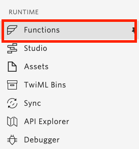
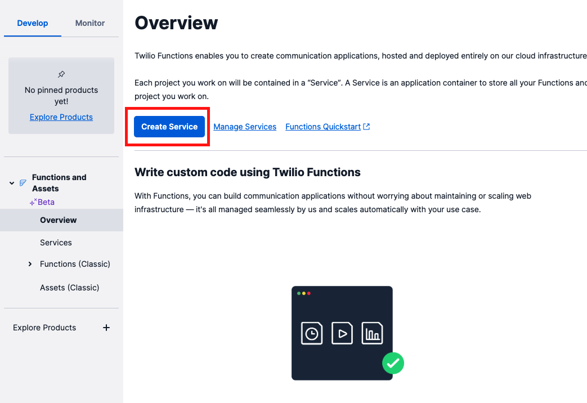
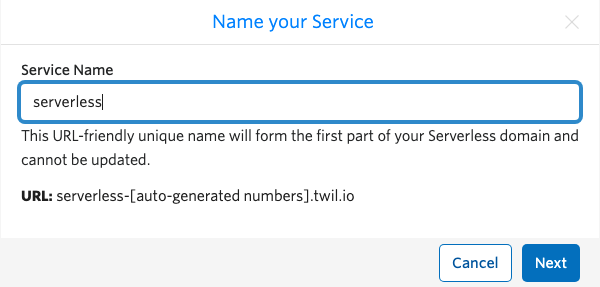
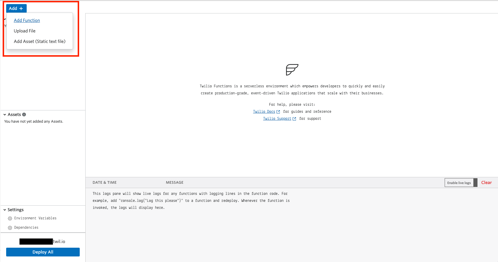
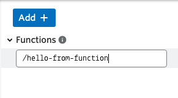
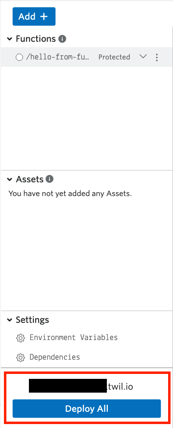
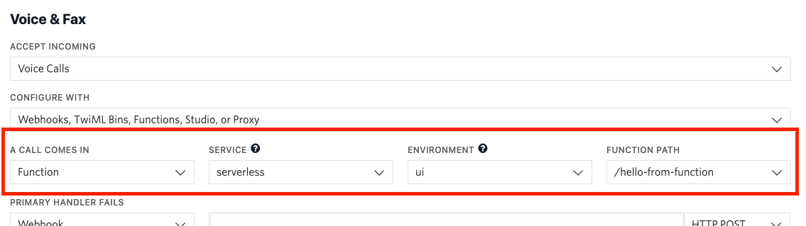

#  手順2: Twilio Functionsを使った応答

TwiML Binsを使うと定型の応答を素早く設定できます。しかし営業時間外のアナウンスなど、日常業務の中では特定の条件に従って応答を変更しなければいけないシナリオが必ず存在します。

この手順ではサーバーレス実行環境である[Twilio Functions](https://jp.twilio.com/docs/runtime/functions)を用いて条件別に応答を変更する方法を学習します。

Twilio FunctionsはWebhook（Webアプリケーション）を利用する方法に比べて次の利点があります。

- サーバーレス実行環境を利用できるため、ローカル環境や別のクラウド環境でWebアプリケーションをホスティングする必要がない。
- セキュアかつ、オートスケーリング機能が提供されている。
- [Twilio RESTヘルパーライブラリー](https://jp.twilio.com/docs/libraries/node)が環境にあらかじめ組み込まれている。

## 手順2-1: サービスを作成

[Functions](https://jp.twilio.com/console/functions)を開くか、サイドナビゲーションからクリックしFunctionsコンソールを開きます。



Overview画面から`Create Service`ボタンをクリックし新しいサービスを作成します。



最初にサービスの名前を入力します。この名前はURLの一部として利用されるため、そちらを意識し設定してください。



## 2-2: Functionを追加

新たにサービスを作成するとUIベースのエディタ画面が表示されます。画面の`Add +`ボタンをクリックし、`Add Function`を選択します。



Functionのパス設定を求められるため、ここで任意の名前を設定します。下記の例では`/hello-from-function`と設定しました。



デフォルトではここで作成したFunctionは`Protected`と設定されます。この場合、Functionの実行には[有効なTwilioリクエスト署名](https://jp.twilio.com/docs/runtime/functions-assets-api/api/understanding-visibility-public-private-and-protected-functions-and-assets#protected)が必要となり、外部からのアクセスを抑制できます。

作成したFunctionにはあらかじめ下記のコードが実装されています。この例はコメントを日本語に意訳し、必要に応じて追記しています。

```js
// これは新しいfunctionです。左のパスを変更できます。
exports.handler = function(context, event, callback) {
  // このfunctionで返すTwiMLの例です。
  let twiml = new Twilio.twiml.VoiceResponse();
  // Hello Worldと発音します。
  twiml.say('Hello World');
    
  let variable = 'welcome!';

  // コンソールにログを残すこともできます。
  console.log('error', variable);

  // callbackを返し、functionの呼び出しを終了します。
  // 正常に終了した場合は、第1引数はnullになります。
  // 必要に応じてTwiMLなど第2引数以降で返します。
  return callback(null, twiml);
};
```

`twiml.say('Hello World')`を下記のように変更し、日本語を返すように設定します。

```js
twiml.say('トゥイリオファンクションで応答を返しています。', {language: 'ja-JP'});
```

設定を終えたのち、`Deploy All`ボタンをクリックし、Functionをデプロイします。



ログにデプロイ完了のメッセージが表示されていれば成功です。

## 2-3: 着信応答を設定

さきほどの[手順1: TwiML Binsを使った応答](01-TwiML-Bins.md)と同じく、[電話番号コンソール](https://jp.twilio.com/console/phone-numbers/incoming)を開き、取得済み番号の詳細画面を表示させます。

先ほどはTwiML Binを設定した項目を`Function`と設定し、`SERVICE`、`ENVIRONMENT`、`FUNCTION PATH`をそれぞれ設定します。下記のスクリーンショットを参考にしてください。



再度同じ番号に電話を掛け、応答メッセージが異なっていることを確認しましょう。

この仕組みを利用すれば着信の際、条件に沿って応答メッセージを変更できます。

## 次の手順

[ハンズオン: Twilio RESTヘルパーライブラリを用いた外部発信](../03-Make-Outbound-Calls/00-Overview.md)