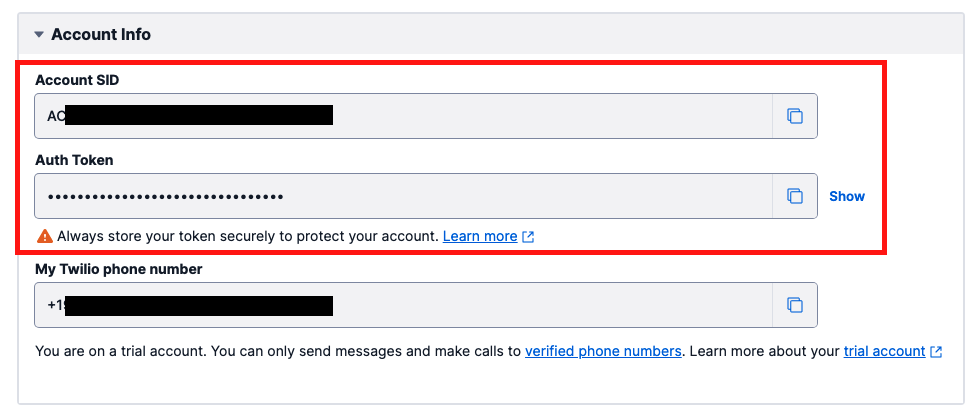

#  手順1: Twilio RESTヘルパーライブラリの導入と準備 

この手順ではTwilio REST APIにアクセスするヘルパーライブラリをインストールし、Twilioクライアントを利用するために資格情報を設定します。

なお、この手順でインストールするパッケージはサーバーアプリケーションでの利用を前提としています。フロントエンド側のプロジェクトには追加しないでください。

## 1-1: サンプルプロジェクトをクローン

ターミナル、またはコマンドプロンプトで次のコマンドを実行し、サンプルプロジェクトをクローンします。`Git`がインストールされていない場合は、[リポジトリ](https://github.com/neri78/Twilio-HandsOn-Voice-JP-SampleApp)の`Code`ボタンから直接Zipファイルをダウンロードし展開してください。

```zsh
git clone https://github.com/neri78/Twilio-HandsOn-Voice-JP-SampleApp.git
```

クローンあるいは展開が完了したのち、プロジェクトフォルダに移動し次のコマンドで依存パッケージをインストールします。

```zsh
cd Twilio-HandsOn-Voice-JP-SampleApp
npm install
```

依存パッケージのインストールが完了した状態でプロジェクトをコードエディタで開きます。

なお、コードエディタであらかじめプロジェクトを開いた状態で依存パッケージをインストールしても構いません。

## 1-2: Twilio資格情報、電話番号を.envファイルに記録

プロジェクトには`.env.sample`というファイルが存在します。このファイルを`.env`とリネームするか、コピーし名前を修正します。

このファイルには次の環境変数が空のまま定義されています。

```zsh
TWILIO_ACCOUNT_SID=
TWILIO_AUTH_TOKEN=
TWILIO_NUMBER=
MY_PHONE_NUMBER=
TWIML_APP_SID=
```

次に[コンソール](https://jp.twilio.com/console)を開きます。この画面のProject Infoに表示されている`Account SID`、`Auth Token`の値をそれぞれ、`TWILIO_ACCOUNT_SID`、`TWILIO_AUTH_TOKEN`に転記します。これらは非常に重要な情報であるため、外部への漏洩や誤って公開しないように十分ご注意ください。



次にこれまでに取得したTwilio番号を`TWILIO_NUMBER`に[E.164フォーマット](https://jp.twilio.com/docs/glossary/what-e164)で入力します。番号を取得していれば、[コンソール](https://jp.twilio.com/console)、または[電話番号コンソール](https://jp.twilio.com/console/phone-numbers/incoming)で確認できます。

最後にTwilioアカウントの登録時に確認コードを受け取った電話番号を同じくE.164フォーマットに変換し`MY_PHONE_NUMBER`へ設定します。日本番号の場合は国番号（+81）をつけ、最初のゼロ（0）を取り除きます。


## 1-3: twilio-nodeヘルパーライブラリをインストール

Twilio REST APIをNode.jsで簡単に利用できる`twilio-node`ヘルパーライブラリを次のコマンドでインストールします。

```zsh
npm i twilio
```
これで次の手順からヘルパーライブラリを使う準備ができました。

## 次の手順

[手順2: ヘルパーライブラリを用いた外部への音声通話発信](02-Make-Outbound-Call.md)