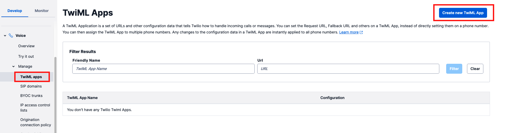
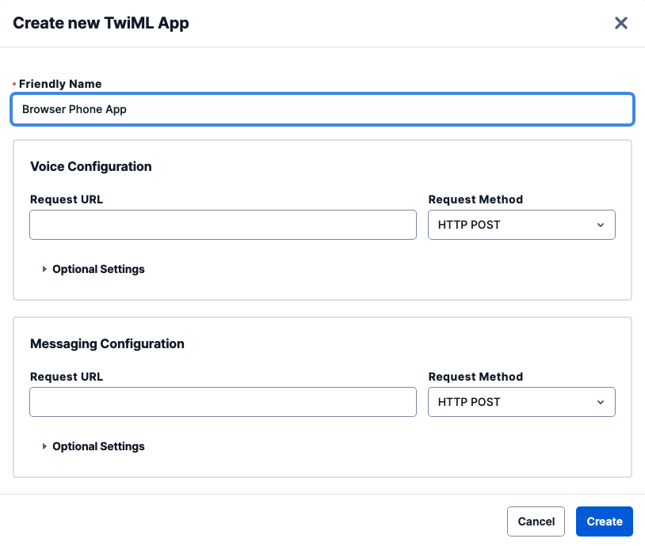
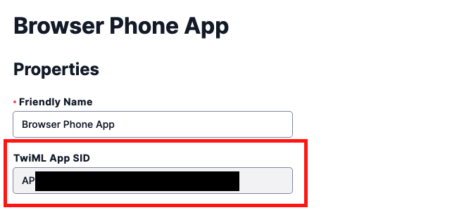
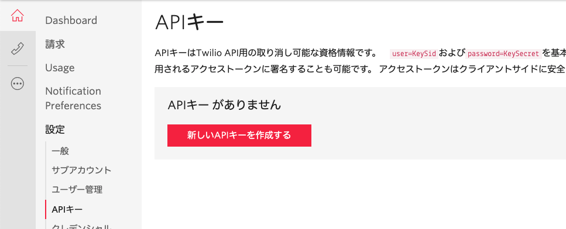
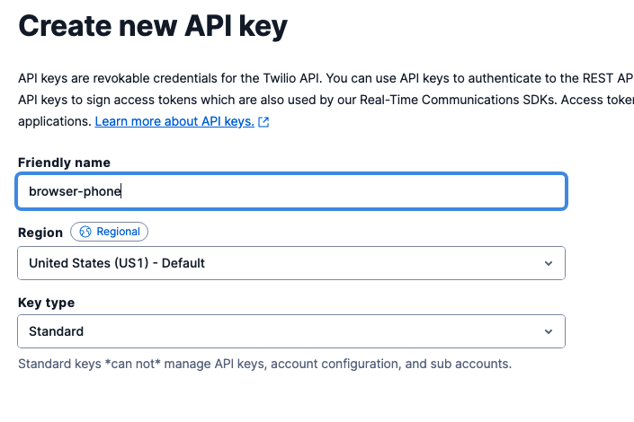
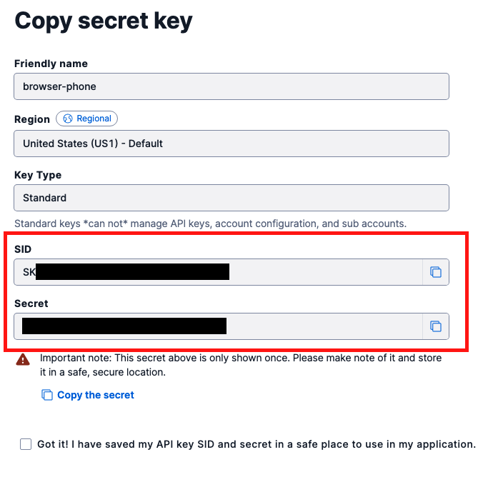

#  手順1: コンソールでTwiML Appを作成

TwiML Appを利用すると受発信をカスタムアプリケーションで制御できるようになります。この手順ではTwiML Appをコンソールで作成する方法を学習します。

## 1-1: コンソールでTwiML Appを作成

[Programmable Voiceコンソール](https://jp.twilio.com/console/voice/twiml/apps)のTwiMLセクションを開き、`Create new TwiML App`ボタンをクリックします。

`FRIENDLY NAME`にわかりやすい名前を入れ、それ以外は空欄のまま、`Create`ボタンをクリックします。

作成後、TwiML Appの一覧が表示されるので先ほど作成したAppの名前をクリックし、詳細画面を表示します。

追加された`SID`を先ほどクローンしたプロジェクトの`TWIML_APP_SID`にコピーします。

ここで作成したTwiML Appを用いてブラウザーフォンを体験します。

## 1-2: APIキー、APIシークレットを作成

次に[コンソール - Dashboard](https://jp.twilio.com/console/project/settings)の`設定`からAPIキーを作成します。

[APIキー](https://jp.twilio.com/console/project/api-keys)を選択し、`新しいキーを作成する`ボタンをクリックします。

`わかりやすい名前`の欄に任意の名前を入力し、キータイプは`Standard`とし、`APIキーを作成する`ボタンをクリックします。

作成された画面に表示されている、`SID`と、`SECRET`を控え、`.env`ファイルの`TWILIO_API_KEY`、`TWILIO_API_SECRET`にそれぞれ転記します。

## 次の手順

[手順2: TwiML Appを使用しブラウザーフォンを設定](02-Experience-Browser-Phone.md)