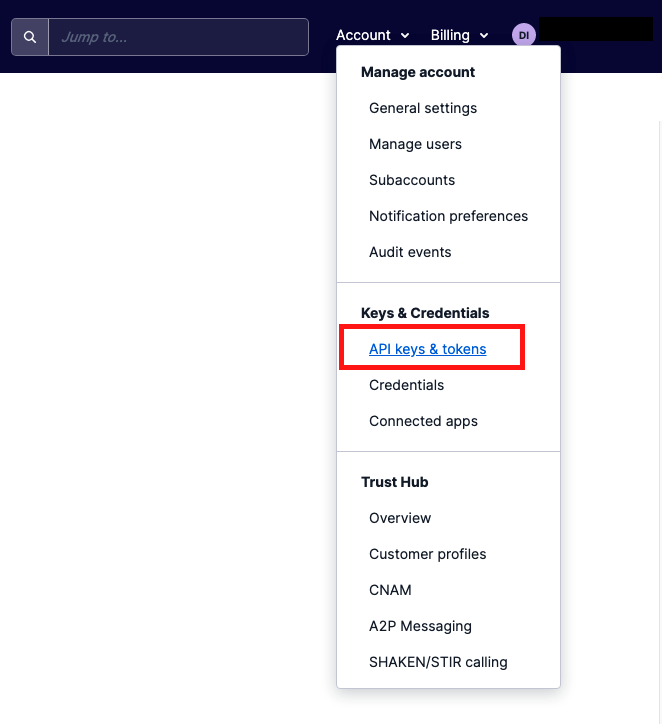

#  手順1: コンソールでTwiML Appを作成

TwiML Appを利用すると受発信をカスタムアプリケーションで制御できるようになります。この手順ではTwiML Appをコンソールで作成する方法を学習します。

## 1-1: APIキー、APIシークレットを作成

TwiML Appで利用する資格情報を生成するため、[Account - API keys & tokens](https://jp.twilio.com/console/project/api-keys)リンクを開くか、または下記のスクリーンショットを参考にAPIキー管理画面を開きます。重要な情報にアクセスするため、ログインしているアカウントに紐づくEメールアドレスへ本人確認のためのワンタイムコードが送信されます。

画面の右側に表示されている `Create API Key`ボタンをクリックし、`Friendly name`に任意の名前を設定します。入力後、`Create API Key`ボタンをクリックします。

作成された画面に表示されている、`SID`と、`SECRET`を控え、`.env`ファイルの`TWILIO_API_KEY`、`TWILIO_API_SECRET`にそれぞれ転記します。

## 1-2: コンソールでTwiML Appを作成

次に[コンソール - Voice - TwiML apps](https://jp.twilio.com/console/voice/twiml/apps)リンク、または製品一覧から`Voice`を選択し、`Manage - TwiML apps`を開きます。

画面の右上に表示されている`Create new TwiML App`ボタンをクリックします。

`Friendly Name`にわかりやすい名前を入れ、それ以外は空欄のまま、`Create`ボタンをクリックします。

作成後、TwiML Appの一覧が表示されるので先ほど作成したAppの名前をクリックし、詳細画面を表示します。

詳細画面の`TwiML App SID`を先ほどクローンしたプロジェクトの`TWIML_APP_SID`にコピーします。

ここで作成したTwiML Appを用いてブラウザーフォンを体験します。

## 次の手順

[手順2: TwiML Appを使用しブラウザーフォンを設定](02-Experience-Browser-Phone.md)