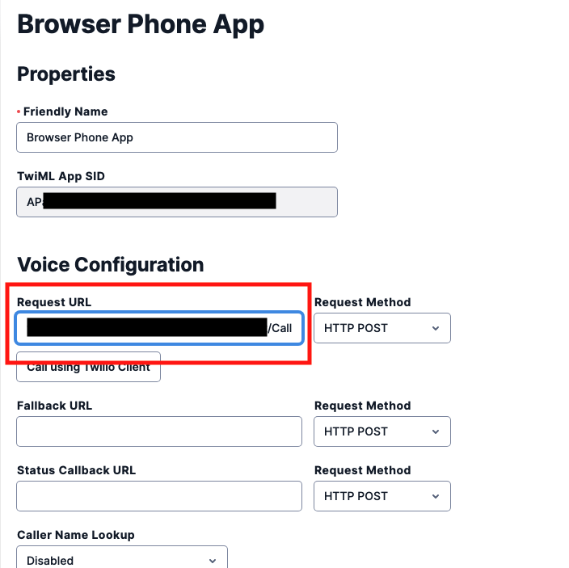

#  手順2: TwiML Appを使用しブラウザーフォンを設定 

この手順では先ほど作成したTwiML AppとWebアプリケーションを接続します。

## 2-1: twilio-clientパッケージをインストールする。

次のコマンドを実行し、Twilio Programmable Voiceクライアント用ライブラリをインストールします。

```zsh
npm i @twilio/voice-sdk
```

## 2-2: Webアプリケーションを起動し、ローカルWebアプリケーションをトンネリングさせる。

次のコマンドを実行し、Webアプリケーションを実行します。本来であれば`http://localhost:3000`で起動しますが、このWebアプリケーションでは[npm - ngrok](https://www.npmjs.com/package/ngrok)を用いて外部に公開できるように設定しています。

```zsh
npm start
```

実行すると次のようなログがターミナル、あるいはコマンドプロンプトに表示されます。

```zsh
Listening port 3000
https://xxxxxxxxx.ngrok.io
```

セキュリティ上、またはファイアウォールの設定でうまく動作しない場合は、別のネットワーク、別のPC等で試してください。

ここで表示されている`https://xxxxxxxxx.ngrok.io`が外部に公開されたURLです。

## 2-3: TwiML AppにWebアプリケーションのURLを設定

先ほどのTwiML Appをコンソールで開き、`REQUEST URL`に公開されたURLならびに`/Call`を加えて設定します。



この設定でTwiML Appに対して接続命令が出された段階で、Request URLにリクエストが送信されます。

`Save`ボタンを押し、変更を反映させます。

## 2-4: ブラウザーフォンを体験

公開されているURL:`https://xxxxxxxxx.ngrok.io`をブラウザーで開くと次のような画面が表示されます。ブラウザーによっては危険なサイトへの接続であることを示す警告が表示されますが、この時点では自身のローカル環境にアクセスしています。


初期化ボタンをクリックすると裏側では`Twilio.Device`が初期化されます。

初期化が終了すると`発信`ボタンが有効になります。
`発信先:`ボックスに認証された電話番号を`E.164フォーマット`で入力し、発信ボタンをクリックするとブラウザー、Twilioを介して手元の電話への発信、会話が可能となります。


このようにTwilioのPhone Number、Programmable Voice、TwiML Appsを組み合わせてブラウザーだけで通話ができるアプリケーションを構築できます。
